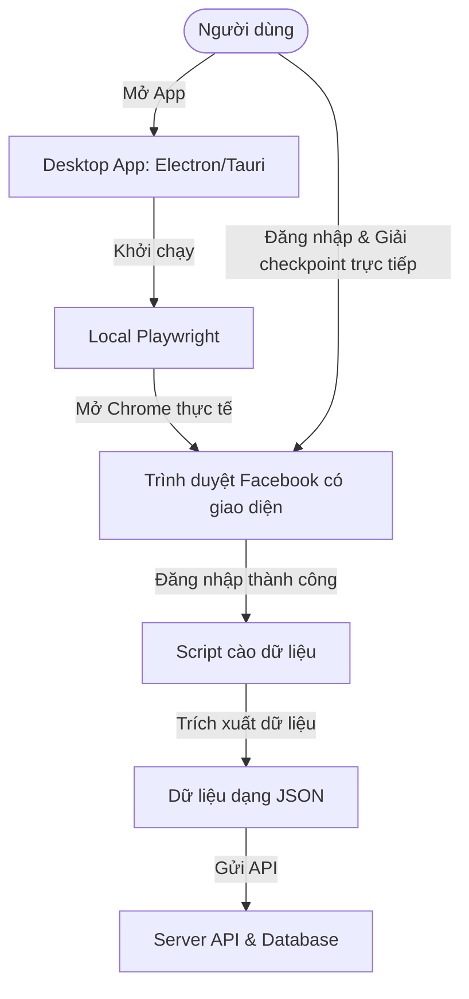

# Kiến trúc: Chuyển đổi sang Client-side Desktop Crawler (Playwright trên Máy Khách)

Tài liệu này phân tích lý do, mục đích và đề xuất phương án kỹ thuật chuyển đổi từ mô hình crawl dữ liệu tập trung trên Server sang mô hình phân tán chạy trên máy của người dùng (Client-side Desktop App).

---

## 1. Bối cảnh & Vấn đề hiện tại (Context & Problem Statement)

Hiện tại, hệ thống crawl dữ liệu Facebook đang được thiết kế chạy trên phía Server (Server-side). Tuy nhiên, khi đưa lên production, mô hình này gặp phải các rào cản lớn từ cơ chế bảo mật của Facebook:

1. **Chặn IP hàng loạt (IP Blacklisting):** Các dải IP của các nhà cung cấp cloud (AWS, DigitalOcean, GCP, Render, Vercel) nằm trong danh sách đen của Facebook. Khi phát hiện request từ các IP này, Facebook ngay lập tức yêu cầu xác thực hoặc khóa tài khoản.
2. **Cơ chế chống Headless rất mạnh:** Trình duyệt chạy ở chế độ ẩn danh (headless) trên server rất dễ bị phát hiện bởi các thuật toán vân tay trình duyệt (Browser Fingerprinting) của Facebook.
3. **Các loại Checkpoint phức tạp:** Facebook thường xuyên yêu cầu xác thực như:
   * Gửi mã OTP về thiết bị tin cậy hoặc SMS.
   * Chọn ảnh bạn bè (Photo tag checkpoint).
   * Phê duyệt đăng nhập từ thiết bị khác.
   * Các checkpoint này cực kỳ khó hoặc không thể giải tự động bằng mã code trên server.
4. **Chi phí vận hành cao:** Chạy hàng chục/hàng trăm luồng trình duyệt Chrome ảo (headed/headless) trên server tiêu tốn cực kỳ nhiều RAM và CPU, đẩy chi phí server lên rất cao.

---

## 2. Mục đích chuyển đổi (Purpose)

Mục đích của việc chuyển dịch kiến trúc sang **Client-side Desktop Crawler** bao gồm:

* **Tận dụng IP tự nhiên:** Sử dụng chính IP mạng của người dùng (mạng gia đình, 4G/5G) - những IP có độ tin cậy (Trust score) cao đối với Facebook, giảm thiểu tối đa tỉ lệ bị khóa tài khoản hoặc dính checkpoint.
* **Người dùng tự giải quyết xác thực (Human-in-the-loop):** Khi Facebook yêu cầu đăng nhập, 2FA, hay checkpoint, trình duyệt sẽ hiển thị trực tiếp (headed mode) trên màn hình máy tính của người dùng để họ tự giải quyết. Bot sẽ tiếp tục tự động chạy sau khi xác thực thành công.
* **Tối ưu hóa chi phí Server:** Server trung tâm chỉ đóng vai trò làm API nhận kết quả lưu vào Database, không cần gánh tài nguyên xử lý của trình duyệt.
* **Độ tin cậy và Tỷ lệ thành công cao:** Đảm bảo hệ thống hoạt động ổn định và lâu dài kể cả khi Facebook cập nhật các biện pháp chống bot mới.

---

## 3. Nguyên nhân Lựa chọn Client-side App (Why Client-side?)

| Đặc điểm | Mô hình Server-side Crawler | Mô hình Client-side Desktop Crawler |
| :--- | :--- | :--- |
| **Địa chỉ IP** | IP Data Center (Dễ bị block, cần thuê proxy đắt đỏ) | IP hộ gia đình của người dùng (Độ tin cậy cao, miễn phí) |
| **Xử lý Checkpoint/2FA** | Cực kỳ khó khăn, cần tích hợp nhiều dịch vụ giải mã bên thứ 3 | Rất dễ dàng, người dùng tự thao tác trực tiếp trên màn hình |
| **Chế độ trình duyệt** | Buộc phải dùng Headless (hoặc giả lập Xvfb phức tạp) | Chạy Headed (có giao diện) trực tiếp trên máy người dùng |
| **Chi phí Server** | Tăng tuyến tính theo số lượng luồng crawl | Cố định và rất thấp (chỉ tốn chi phí lưu trữ DB/API) |
| **Khả năng scale** | Bị giới hạn bởi cấu hình và chi phí phần cứng server | Tự động scale theo số lượng người dùng tải ứng dụng |

---

## 4. Đề xuất Phương án Kỹ thuật (Proposed Solution)

Để Playwright có thể chạy trực tiếp trên máy của người dùng, chúng ta sẽ đóng gói ứng dụng web hiện tại thành một ứng dụng Desktop bằng **Electron** hoặc **Tauri**.

### Các bước hoạt động chính của App:
1. **Khởi động:** Người dùng mở ứng dụng Desktop trên máy tính.
2. **Đăng nhập & Lưu Session:** 
   * Lần đầu sử dụng, ứng dụng mở một cửa sổ trình duyệt (headed) trỏ tới Facebook.
   * Người dùng đăng nhập tài khoản của họ và giải quyết mọi checkpoint (nếu có).
   * Ứng dụng lưu trữ Cookie/Session trạng thái đăng nhập vào máy cục bộ của họ.
3. **Chạy ngầm (Auto-crawl):** 
   * Ở các lần chạy tiếp theo, ứng dụng tự động nạp Session đã lưu, chạy trình duyệt ẩn danh (hoặc hiện cửa sổ thu nhỏ) để cào dữ liệu bài viết/nhóm theo yêu cầu mà không làm phiền người dùng.
4. **Đồng bộ hóa:** Dữ liệu cào được sẽ được gửi về Server API trung tâm thông qua các kết nối bảo mật để tổng hợp và hiển thị trên giao diện quản trị.

### Giải pháp xử lý việc Facebook cập nhật DOM (HTML thay đổi):
Để tránh việc phải bắt người dùng cập nhật ứng dụng liên tục:
* **Dynamic Script Loader:** Khi Desktop App chạy lệnh crawl, nó sẽ gửi request lên Server để tải về file script cào mới nhất (ví dụ: `extractor.js`).
* Ứng dụng sẽ thực thi file script động này trong ngữ cảnh của Playwright cục bộ. Khi Facebook đổi giao diện, chúng ta chỉ cần cập nhật file `extractor.js` trên Server mà không cần build lại app.
