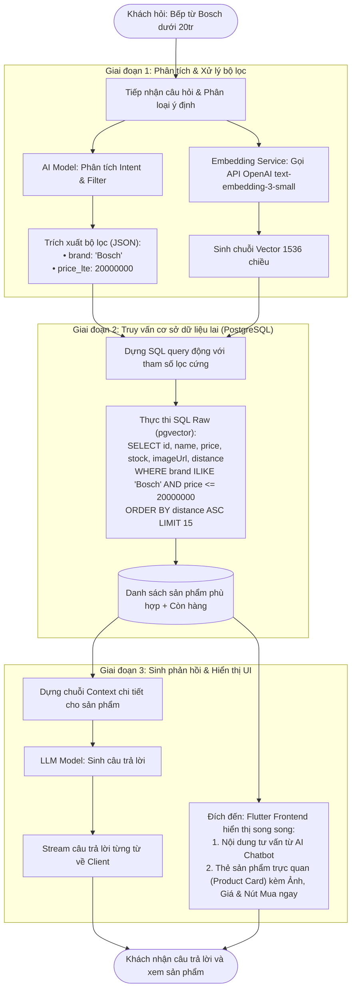

# TÀI LIỆU: LUỒNG HOẠT ĐỘNG VÀ KIẾN TRÚC AI CHATBOT (BIZMIND AI)

Tài liệu này trình bày chi tiết về luồng xử lý kỹ thuật của Chatbot, các ưu điểm kiến trúc so với việc sử dụng cơ sở dữ liệu Vector độc lập (như Pinecone, Qdrant), và sơ đồ luồng dữ liệu chi tiết từ khi tiếp nhận câu hỏi đến đầu ra giao diện.

---

## 1. Ưu Điểm Của Kiến Trúc Hợp Nhất (PostgreSQL + pgvector) So Với Vector DB Ngoài (Pinecone, Qdrant)

Trong quá trình phát triển, dự án quyết định loại bỏ các cơ sở dữ liệu Vector ngoài (Pinecone) để chuyển sang dùng **PostgreSQL tích hợp `pgvector`**. Vì các lý do sau:

### A. Đồng bộ dữ liệu tuyệt đối
* **Single Source of Truth:** Khi thông tin sản phẩm thay đổi (như giá bếp từ giảm từ 20tr xuống 18tr, hoặc số lượng tồn kho về 0), phải thực hiện ghi vào PostgreSQL đồng thời gọi API cập nhật metadata trên Pinecone. Nếu đưa thêm Pinecone vào, sẽ phải quản lý thêm một dịch vụ Database thứ hai. Mất nhiều thờ gian và công sức hơn để đồng bộ dữ liệu giữa PostgreSQL và pinecone.

### B. Tối ưu chi phí vận hành
* **Vấn đề của Pinecone:** Pinecone là dịch vụ đám mây tính phí theo giờ và theo lượng vector lưu trữ (có chi phí khá đắt đỏ đối với doanh nghiệp SME).
* **Giải pháp của pgvector:** Tích hợp trực tiếp vào PostgreSQL hiện có của dự án. Doanh nghiệp không tốn thêm bất kỳ chi phí duy trì máy chủ riêng biệt nào cho cơ sở dữ liệu Vector.

### C. Khả năng truy vấn lai (Hybrid Query) mạnh mẽ và đơn giản
* **Hybrid Search đơn giản:** Cột Vector và các cột thông tin thường (`price`, `stock`, `brand`) nằm trên **cùng một hàng của một bảng duy nhất**. Khi nhân viên cập nhật thông tin sản phẩm trên Admin Portal, dữ liệu vector và số liệu thực tế được cập nhật đồng thời trong **một giao dịch duy nhất**. Chatbot đảm bảo luôn lấy được dữ liệu thời gian thực mới nhất. Với PostgreSQL, có thể thực hiện việc này rất đơn giản bằng một câu query SQL. Với Pinecone, việc thực hiện hybrid query kết hợp lọc dữ liệu quan hệ phức tạp từ Postgres sẽ khó khăn và cồng kềnh hơn nhiều.

### D. Khi nào mới cần cân nhắc chuyển sang Pinecone / Qdrant?
Xem xét nâng cấp hoặc di chuyển sang các Vector DB chuyên dụng (như Pinecone hoặc Qdrant) chỉ khi gặp các bài toán quy mô lớn sau:
1. **Dữ liệu Vector phình to vượt ngưỡng (Hàng triệu bản ghi):** Khi số lượng sản phẩm hoặc tài liệu nội bộ đạt mốc từ 1 triệu trở lên. Ở quy mô này, việc tính toán khoảng cách vector trên PostgreSQL sẽ ngốn rất nhiều tài nguyên (RAM, CPU), làm chậm các câu truy vấn thông thường của hệ thống.
2. **Yêu cầu độ trễ cực thấp (Ultra-low Latency < 20ms):** Khi hệ thống phục vụ hàng chục ngàn người dùng chat đồng thời và cần tốc độ tìm kiếm tương đồng vector tính bằng mili-giây trên tập dữ liệu lớn.
3. **Tìm kiếm đa dạng namespaces / Multi-Vector:** Khi hệ thống cần lưu nhiều vector cho cùng một sản phẩm như vector tìm bằng ảnh, vector tìm bằng văn bản, vector tài liệu kỹ thuật riêng biệt (*pgvector vẫn giải quyết được tuy không tối ưu như Pinecone/Qdrant bằng cách thêm nhiều cột vector vào cùng bảng Product hoặc tách ra bảng phụ liên kết 1-Nhiều*).
4. **Phân tán & Tự động co giãn (Distributed Cluster):** Khi cần dữ liệu vector tự động sharding (chia mảnh) và chạy cụm nhiều máy chủ dự phòng trên toàn cầu để đảm bảo hệ thống không bị gián đoạn.
---

## 2. Sơ Đồ Luồng Xử Lý Chi Tiết: Từ Bộ Lọc Đến Đích Đến Giao Diện

Dưới đây là quy trình xử lý chi tiết từ khi khách hàng đưa ra câu hỏi, qua các bước xử lý bộ lọc, truy vấn cơ sở dữ liệu cho đến khi hiển thị kết quả ra giao diện người dùng:

## 3. Các Nhánh Xử Lý Chính

### A. Luồng Tư vấn Sản phẩm (Structured RAG)
* **Phân tích bộ lọc:** Hệ thống sử dụng AI để bóc tách thông tin lọc cứng từ câu hỏi của người dùng (ví dụ: thương hiệu `brand = 'Bosch'`, mức giá tối đa `price_lte = 20000000`).
* **Truy vấn cơ sở dữ liệu:** Thực hiện tìm kiếm lai (Hybrid Search) trực tiếp trên PostgreSQL:
  * **Lọc cứng:** Chỉ lọc các sản phẩm khớp với thương hiệu và mức giá yêu cầu, đồng thời bắt buộc sản phẩm phải còn trong kho (`stock > 0`).
  * **Tìm kiếm tương đồng:** So sánh Vector câu hỏi với dữ liệu sản phẩm để xếp hạng độ phù hợp ngữ nghĩa.
* **AI phản hồi:** Trợ lý AI tổng hợp dữ liệu sản phẩm tìm được và phản hồi trực nhiên kèm giá bán, tồn kho thực tế của sản phẩm.

### B. Luồng Chuyển Tiếp Cho Con Người (Human Handover)
Khi khách hàng có nhu cầu gặp nhân viên hoặc khiếu nại (`HUMAN_ASSISTANCE`):
* **Xác nhận với khách hàng:** Chatbot tự động trả lời tin nhắn trấn an: *"Dạ, em đã chuyển thông tin của anh/chị cho nhân viên trực chat. Nhân viên sẽ liên hệ hỗ trợ mình ngay bây giờ nhé ạ!"*
* **Đẩy cảnh báo thời gian thực:** Hệ thống broadcast sự kiện qua **WebSockets** (Socket.io) đến Admin Portal. Màn hình của nhân viên trực sẽ hiển thị popup khẩn cấp màu đỏ để họ vào tiếp quản cuộc trò chuyện ngay lập tức.

### C. Luồng Tra cứu Đơn hàng (Order Lookup)
Khi khách hỏi tình trạng đơn hàng:
1. **Trích xuất thông tin:** Hệ thống tự động quét số điện thoại hoặc mã đơn hàng (dạng `BM-xxxxxx`) từ tin nhắn bằng thuật toán Regex kết hợp AI.
2. **Tìm kiếm dữ liệu:** Truy vấn trạng thái đơn hàng mới nhất trong Database (Đang xử lý, Đang giao, Đã giao, Đã hủy).
3. **Trả kết quả:** Phản hồi chi tiết hành trình đơn để khách hàng chủ động theo dõi mà không cần chờ đợi nhân viên hỗ trợ thủ công.

---

## 4. Quản Trị & Cấu Hình Động (Admin Controls)
Hệ thống cung cấp một trang cấu hình hoàn chỉnh dành cho Quản lý tại Admin Portal để điều phối hoạt động chatbot thời gian thực:

* **Bật/Tắt tự động phản hồi (`ai_auto_reply_enabled`):**
  * **Bật (`true`):** Chatbot AI tự động trả lời khách hàng trên Facebook Messenger.
  * **Tắt (`false`):** Chatbot chỉ ghi nhận tin nhắn vào database và đẩy thông báo cho nhân viên, không tự ý phản hồi khách.
* **Cách ly Prompt hệ thống:**
  * Quyền cấu hình Prompt hệ thống được phân chia theo phòng ban: **Sale** (Tư vấn bán hàng), **Kế toán** (Đối chiếu công nợ), **Marketing** (Giới thiệu chiến dịch).
  * Kênh Facebook Messenger sử dụng Prompt cứng tối giản cài đặt ở Backend để tránh trường hợp người dùng sửa nhầm Prompt làm AI trả lời sai quy chuẩn.

---

## 5. Hướng Dẫn Sử Dụng & Kiểm Thử Kênh Messenger

Để Ban quản trị và nhóm Kiểm thử (Tester) có thể vận hành, chạy thử nghiệm luồng Chatbot Messenger, vui lòng thực hiện theo các bước hướng dẫn dưới đây:

### A. Kích hoạt/Vận hành trên Admin Portal (Trang quản trị)
1. **Truy cập đường dẫn:** Đăng nhập vào trang quản trị thông qua link: [bizmind-ai-eight.vercel.app/#/settings](https://bizmind-ai-eight.vercel.app/#/settings) (Admin Settings).
2. **Bật cấu hình:** Tìm ô cấu hình nhập/nút chuyển đổi (Toggle Switch) có nhãn **"Bật/Tắt tự động phản hồi AI"**.

### B. Quy trình chạy thử (Chạy Test)
1. **Tài khoản chạy test:** 
   * Do Fanpage đang ở chế độ Phát triển (Development Mode), chỉ các tài khoản Facebook nằm trong danh sách **Vai trò (Roles) -> Người thử nghiệm (Testers)** mới có quyền nhắn tin và nhận phản hồi từ Chatbot.
2. **Gửi tin nhắn test:**
   * Dùng tài khoản Facebook Test truy cập và bấm nhắn tin trực tiếp đến [**Facebook Fanpage**](https://www.facebook.com/Germanysnt/) đã được liên kết với Token ứng dụng.
   * Gửi các nội dung như: *"Shop ơi có bếp từ Bosch PIE631FB1E dưới 20 triệu không?"*
3. **Theo dõi kết quả:**
   * **Phản hồi tự động:** Chatbot sẽ phản hồi trực tiếp trên Messenger sau vài giây.
   * **Kiểm tra trên Admin Portal:** Vào phần quản lý chat hoặc kiểm tra lịch sử sẽ thấy toàn bộ hội thoại được hiển thị ở chuông thông báo.