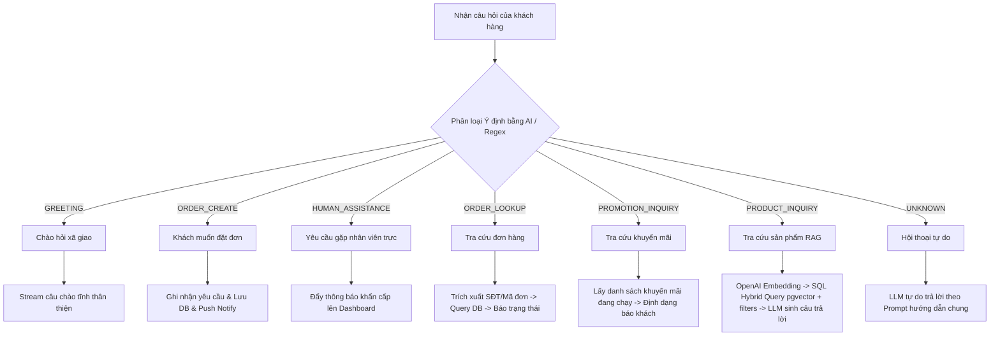

# Tài liệu Kỹ thuật: Hệ thống AI Chatbot & Tự động phản hồi (Auto-Reply)

Tài liệu này mô tả chi tiết kiến trúc, các luồng xử lý (flows) và các tính năng chính của hệ thống Chatbot tích hợp RAG tự động trên nền tảng Bizmind AI.

---

## 1. Tổng quan & Các tính năng chính

Hệ thống AI Chatbot của Bizmind AI được thiết kế dưới dạng **Modular & Self-Contained RAG System**, chịu trách nhiệm tiếp nhận tin nhắn từ nhiều nguồn (Admin Portal `/chat` và Facebook Messenger Webhook), phân tích ý định, truy vấn dữ liệu từ PostgreSQL (pgvector) và tự động phản hồi khách hàng theo thời gian thực.

### Các tính năng cốt lõi:
1. **Tự động phản hồi (Auto-Reply)**: Cấu hình bật/tắt động thông qua thuộc tính `ai_auto_reply_enabled` lưu ở Database. Khi bật, AI sẽ tự động trả lời khách hàng trên Messenger. Khi tắt, hệ thống chỉ lưu tin nhắn và đẩy thông báo cho nhân viên trực hỗ trợ thủ công.
2. **Cách ly Prompt Bảo mật (Prompt Isolation)**:
   - **Kênh Messenger (Facebook/Messenger)**: Sử dụng các mẫu Prompt hệ thống cố định cứng (static) ở Backend nhằm đảm bảo tính an toàn cao, tránh việc người dùng cấu hình nhầm làm hỏng luồng phục vụ khách hàng.
   - **Kênh Admin Portal (`/chat`)**: Sử dụng mẫu Prompt động tải từ Database (`system_prompt_sale`) cho phép quản trị viên chỉnh sửa, tùy biến linh hoạt ngay trên giao diện cài đặt Admin.
3. **Lưu lịch sử hội thoại tự động**: Mọi tin nhắn gửi đến từ khách hàng (`role: 'user'`) và câu trả lời phản hồi từ AI (`role: 'assistant'`) đều được lưu trữ trực tiếp vào bảng `FacebookChatMessage` trong PostgreSQL để phục vụ hiển thị lại cho nhân viên tư vấn.
4. **Thông báo thời gian thực (WebSockets)**: Sử dụng Socket.io để đẩy cảnh báo lập tức (như khách cần hỗ trợ gấp, khách muốn đặt hàng) về Dashboard của nhân viên trực.

---

## 2. Luồng xử lý Ý định (Intent-Based Routing Flow)

Khi một tin nhắn được gửi tới `ChatService`, hệ thống sẽ thực hiện phân loại ý định (Intent Classification) bằng AI kết hợp bộ lọc Regex dự phòng trước khi định tuyến luồng xử lý:

### Chi tiết các luồng xử lý ý định:

### A. GREETING (Chào hỏi)
- **Hành vi**: Trả về trực tiếp chuỗi phản hồi chào hỏi thân thiện cố định (giúp tiết kiệm token và tăng tốc độ phản hồi tối đa).
- **Mẫu trả về**: `"Dạ, Em chào anh/chị! Em có thể giúp gì cho anh/chị hôm nay ạ?"`

### B. ORDER_CREATE (Yêu cầu mua hàng/Chốt đơn)
- **Hành vi**: Trả về tin nhắn xác nhận đã tiếp nhận yêu cầu đặt hàng, đồng thời hệ thống tự động đẩy một thông báo có độ ưu tiên cao về Dashboard để nhân viên vào lên đơn thủ công.
- **Mẫu trả về**: `"Dạ, em đã nhận được yêu cầu đặt hàng của anh/chị. Em sẽ chuyển thông tin cho nhân viên trực để lên đơn và liên hệ lại cho mình ngay nhé ạ!"`

### C. HUMAN_ASSISTANCE (Yêu cầu gặp con người)
- **Hành vi**: Phản hồi tin nhắn trấn an khách hàng. Đồng thời, qua cổng WebSocket, Server gửi sự kiện `ASSISTANCE_REQUIRED` lập tức hiển thị popup đỏ cảnh báo trên màn hình của nhân viên trực chat.
- **Mẫu trả về**: `"Dạ, em đã chuyển thông tin của anh/chị cho nhân viên trực chat. Nhân viên sẽ liên hệ hỗ trợ mình ngay bây giờ nhé ạ!"`

### D. ORDER_LOOKUP (Tra cứu trạng thái đơn hàng)
- **Hành vi**:
  1. Trích xuất thông tin tìm kiếm (Mã đơn hàng có dạng `BM-xxxxxx` hoặc số điện thoại 9-11 số) từ tin nhắn bằng Regex và AI.
  2. Truy vấn tối đa 3 đơn hàng mới nhất trong bảng `Order` của PostgreSQL.
  3. Định dạng và trả về trạng thái đơn hàng chi tiết (Đang xử lý ⏳, Đang giao 🚚, Đã giao ✅, Đã hủy ❌) kèm theo địa chỉ nhận hàng và ngày đặt.

### E. PROMOTION_INQUIRY (Hỏi đáp chương trình khuyến mãi)
- **Hành vi**:
  1. Truy vấn các chiến dịch khuyến mãi đang hoạt động trong bảng `Promotion` (thỏa mãn `isActive = true` và thời gian hiện tại nằm trong khoảng `startDate` đến `endDate`).
  2. Tổng hợp mã giảm giá, mô tả nội dung và hạn sử dụng gửi trả cho khách hàng dưới dạng danh sách dễ đọc.

### F. PRODUCT_INQUIRY (Structured RAG - Tra cứu sản phẩm nâng cao)
- **Hành vi**:
  1. **Sinh Vector**: Gọi OpenAI API (`text-embedding-3-small`) để sinh vector biểu diễn 1536 chiều cho câu hỏi.
  2. **Trích xuất bộ lọc**: Phân tích câu hỏi bằng AI để bóc tách các điều kiện lọc cứng (ví dụ thương hiệu: `brand`, giá trần: `price_lte`).
  3. **SQL Hybrid Query**: Thực thi truy vấn SQL Raw tính toán khoảng cách cosine tương đồng vector kết hợp lọc cứng bằng SQL để lấy ra Top kết quả phù hợp nhất trong bảng `Product`.
  4. **Sinh câu trả lời**: Gửi ngữ cảnh sản phẩm tìm thấy kèm lịch sử chat 10 tin nhắn gần nhất qua Prompt để LLM trả lời chi tiết thông số kỹ thuật, giá cả, và tồn kho.

### G. UNKNOWN (Hội thoại thường)
- **Hành vi**: Áp dụng prompt hội thoại thông thường để trả lời các câu hỏi ngoài lề một cách lịch sự, luôn hướng khách hàng quay lại chủ đề sản phẩm của shop và tuyệt đối không tự bịa ra thông tin sai lệch.

---

## 3. Quản lý trạng thái & Cấu hình Settings

Hệ thống lưu trữ các tham số hoạt động trong bảng `SystemSetting` dưới dạng Key-Value cặp chuỗi:

| Khóa cấu hình (`key`) | Mô tả tính năng | Giá trị mặc định |
| :--- | :--- | :--- |
| **`ai_auto_reply_enabled`** | Trạng thái bật/tắt chatbot AI tự động trả lời Messenger | `'true'` (Bật) |
| **`company_name`** | Tên đại diện cửa hàng/doanh nghiệp hiển thị trong prompt | `'Cửa hàng'` |
| **`system_prompt_sale`** | System Prompt dùng cho phòng Sale (Admin Portal `/chat`) | Bản hướng dẫn bán hàng & RAG chi tiết |
| **`system_prompt_accounting`** | System Prompt dùng cho phòng Kế toán | Bản hướng dẫn nghiệp vụ công nợ/hóa đơn |
| **`system_prompt_marketing`** | System Prompt dùng cho phòng Marketing | Bản hướng dẫn tư vấn chiến dịch thương hiệu |

*Mọi thay đổi cấu hình trên trang **Cấu hình** của Admin Portal sẽ ngay lập tức được cập nhật vào PostgreSQL và áp dụng tức thì ở lần chat tiếp theo mà không cần khởi động lại Server.*
